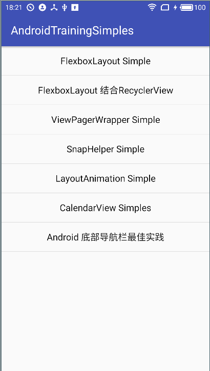

### Android Training Simples

**不定期更新中...**

 
博客demo 代码合集，详细使用请看对应博客

 

 
### 博客

1, FlexboxLayout Simples
 
[Android可伸缩布局－FlexboxLayout(支持RecyclerView集成)](http://www.jianshu.com/p/3c471953e36d) 

2, SnapHelper Simples

[Android中使用RecyclerView + SnapHelper实现类似ViewPager效果](http://www.jianshu.com/p/ef3a3b8d0a77)

3, Android 底部导航栏 Simples 

[Android 底部导航栏 (底部 Tab) 最佳实践](https://juejin.im/post/5901b564570c35005804424b)
 